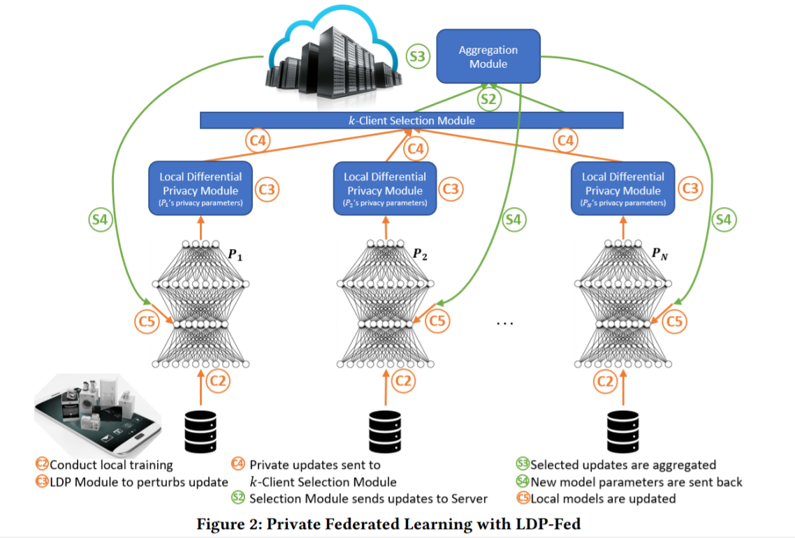
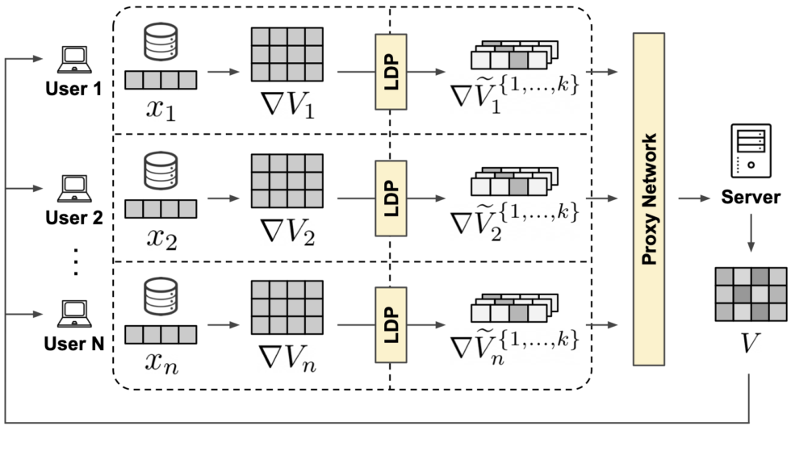

# 
 **Decentralized biometric payment systems**

#  1. Problem statement: 

The transaction value for the Global Digital Payments Market was USD 5.44 trillion in 2020, and it is projected to be worth USD 11.29 trillion by 2026 by Berkshire&#39;s analysts, registering a CAGR of 11.21% during the period of 2021-2026. This demand for cashless payments was driven by greater convenience, favorable government policies, and evolving consumer behavior.

In parallel, blockchain technology, a disruptive factor in the financial market, with the market valued estimated to be USD 5.4 billion in 2021 and the sector is growing at an unprecedented speed.

Along this rapid growth outlines a cyber-security concern for the usage of such digital payment systems. In the case of offline thefts, damages are only subject to the available amount of cash the person is carrying. However, in digital transactions, the damages can be irrevocable.

At the user level, specifically in the streaming and digital content creation industry, we see some inefficiency and obscurity in **donation** and **fundraising,** whereby middlemen take a hefty cut of overall earning, the profits are not publicly known and verified by users. In addition, a cost-effective and trusted solution for small amount transactions between family and friends using biometric authentication should be convenient

So our solution is to implement a blockchain ledger integrated with a biometric authentication system to ensure user data privacy, also offering ease of use for transacting and authenticating. This system should be able to efficiently transact digital goods by using biometric authentication while keeping all of the users&#39; data securely on their devices.

#  2. Solution and advantages:

###  a. Blockchain ledger with biometrics authentication, ease of use:

Thanks to recent advances in machine learning detection algorithms and the sensor industry, biometrics authentication is gaining widespread popularity for being both secure and cost-effective (according to a Visa survey, two-thirds of Europeans want to use biometrics as a method of payment authentication).

In our setting, the metric is FaceID. It is considered highly secure and when integrated with other methods to form a multi-factor authentication, cyber penetration is unlikely. Our algorithm should adapt with user FaceID over time as they gradually use the system. In case of a sudden change (surgery, big beard cut, etc), a passcode will be used to re-registered biometrics information.

###  b. Technical jargons:

 **i. Methods of learning** : LDP-Fed (Federated Learning with Local Differential Privacy Module)

  

 <a href="https://arxiv.org/abs/2006.03637"> [arXiv:2006.03637]cs.[LG] </a>

&nbsp;&nbsp; There will be 3 main components of the network: **User** (or referred to as clients), **Proxy Network** (or k-Client Selection Module), and **Sever.** As the name suggested, users will be mobile devices or small-scale participants in the network, the proxy is used to performing data aggregation, communicating users with the server, while the server is used to update each pass or iteration of the algorithm globally.

*Details about each component are provided below:*

 
 

 <a href="https://brave.com/federated-learning/" align="center"> https://brave.com/federated-learning/ </a>

**&nbsp;&nbsp;&nbsp; Client &amp; LDP Module:  **
Initially, each client randomly initializes its own local user embedding **xu**. The client is tasked with continuously processing the incoming item matrix **V** from the server and using it to update the local user embedding and producing a local item matrix gradient update **∇V**. The client never shares its local user embedding with anyone. The local item matrix update is privatized (masked) by the **LDP module** and shared safely with the proxy network. Once the training has finished, the client can use its local embedding in conjunction with the latest item matrix received. This update is to make sure that the model can adapt to changes in facial details over time.

**&nbsp;&nbsp;&nbsp; Proxy Network:  **
Once the privatized updates reach the proxy network, these are stripped of their metadata (i.e. IP address), split into single updates, shuffled with the updates from other users to break any existing timing patterns, and finally, forwarded to the server. The proxy network takes care of breaking linkability between the streams of multiple updates coming from each client at each epoch. This reduces the user fingerprinting surface and prevents the recommender from building any longitudinal representation of the user, both within and across epochs.

**&nbsp;&nbsp;&nbsp; Server:  **
At the very beginning, the server randomly initializes an item matrix, which constitutes the global part of the shared model. This is shipped to all the clients to initiate the federated learning process in epoch 0. At each epoch, once enough privatized gradient updates reach the server, they are aggregated together to reconstruct a global item matrix update ∇V. This is used to compute an updated item matrix V′, which is then shipped to each client to initiate the next federated learning epoch.

  **ii. Model Architecture:** FaceNet with MTCNN for input processing. (các bro)

  **iii. The blockchain ledger:** Refer to future development. Plan to use existing resources in ETH&#39;s ecosystem.  
**\*\*** _Due to time constraint of the hackathon, only a prototype for face recognition system is being developed. In the future, the ledger along with all functionalities might be completed and the apps can be deployed for community usage. Currently, we plan to have a blockchain build on top of ETH and utilize their existing ecosystem (**Golem:** utilizing, scaling up computing system; **Raiden:** transaction and multi-party payments; **Gnosis:** market analysis and trading platforms)_ **\*\***

###  c. Functions and requirements:
  1. **An effective in-device machine-learning algorithm** that can accurately identify users by faceID, while in the meantime, keeping all data secure.
  2. **The MVP** should be able to recognize human faces and have a database system to store save the feature output vector.
  3. **MFA (multi-factor authentication)**: Along with FaceID, touchID, passcode, pin, or registered devices can be used as extra factors to create a practically impenetrable system.
  4. **Referral system:** while scaling up, we believe giving a reward by issuing and giving a token would be a logical move to incentivize more people to join our network. This also helps create an active community and many potential services. Moreover, we think additional machine learning problems can come up as more demand, services are needed.

###  d. What we offer:

  1. **Globalization:** Thanks to the sharing of computing resources, scalability is achievable and there should be little difference between geographical area once our network we achieve a certain scale.
  2. **Secure:** Blockchain and multi-factor authentication.
  3. **Privacy:** Source codes, machine learning models are open sources so it is eliminated all trust issues. In addition, users&#39; data security can be achieved by masking before being sent to the server for aggregation.
  4. **Simplicity:** It&#39;s as simple as opening your own smartphone with faceID, but now you have access to all banking services. And it&#39;s extremely quick

#  3. Challenge and competition:

The Digital Payments Market is moderately concentrated. The competitive rivalry in the market studied is moderate, as a good number of players prevail. Despite the existence of several companies in the market studied, firms are required to keep innovating their products, in order to gain a sustainable competitive edge over their rivals and provide product differentiation.

There are many predecessors in the digital payment industry, with large-scale investment and funding for a variety of projects. To name a few competitors:

- Google Pay
- Visa 
- Paypal

#  4. Future Roadmap:

# References:  
  https://brave.com/federated-learning/  
  https://arxiv.org/abs/2006.03637  
  https://github.com/pytorch/android-demo-app  
  https://towardsdatascience.com/facial-recognition-login-system-using-deep-learning-reactjs-61bff981eb74  
  https://heartbeat.comet.ml/deploying-pytorch-and-keras-models-to-android-with-tensorflow-mobile-a16a1fb83f2  
  https://bps.money/?fbclid=IwAR0A5mqqFhycuMzl0mwKlQ8E9XDAAREiXwcRIfShnRLKCdUZ0td43r3OrNI  
